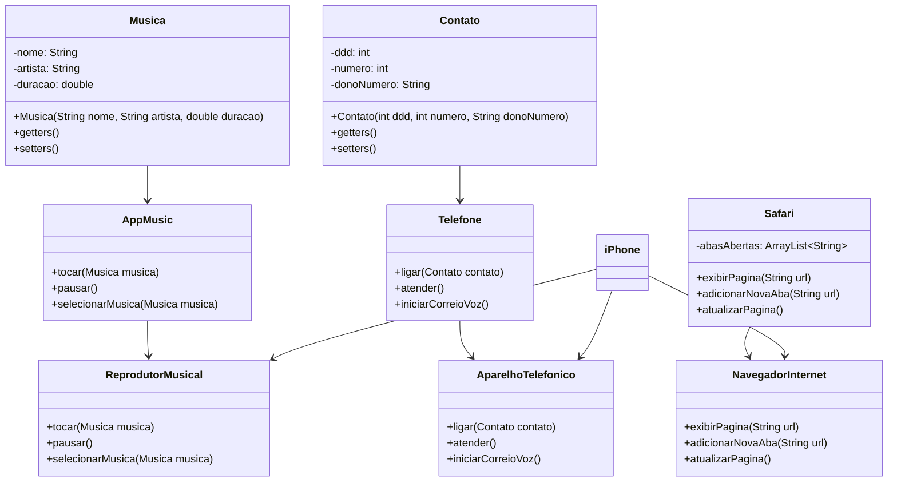

```mermaid
classDiagram
    class Musica {
    -nome: String
    -artista: String
    -duracao: double
    +Musica(String nome, String artista, double duracao)
    +getters()
    +setters()
    }

    class Contato {
        -ddd: int
        -numero: int
        -donoNumero: String
        +Contato(int ddd, int numero, String donoNumero)
        +getters()
        +setters()
    }

    class AppMusic {
        +tocar(Musica musica)
        +pausar()
        +selecionarMusica(Musica musica)
    }

    class Telefone {
        +ligar(Contato contato)
        +atender()
        +iniciarCorreioVoz()
    }

    class Safari {
        -abasAbertas: ArrayList~String~
        +exibirPagina(String url)
        +adicionarNovaAba(String url)
        +atualizarPagina()
    }

    class ReprodutorMusical {
        +tocar(Musica musica)
        +pausar()
        +selecionarMusica(Musica musica)
    }

    class AparelhoTelefonico {
        +ligar(Contato contato)
        +atender()
        +iniciarCorreioVoz()
    }

    class NavegadorInternet {
        +exibirPagina(String url)
        +adicionarNovaAba(String url)
        +atualizarPagina()
    }

    class iPhone {
    }
    Musica --> AppMusic
    AppMusic --> ReprodutorMusical
    Contato --> Telefone
    Telefone --> AparelhoTelefonico
    Safari --> NavegadorInternet
    iPhone --> ReprodutorMusical
    iPhone --> AparelhoTelefonico
    iPhone --> NavegadorInternet
```