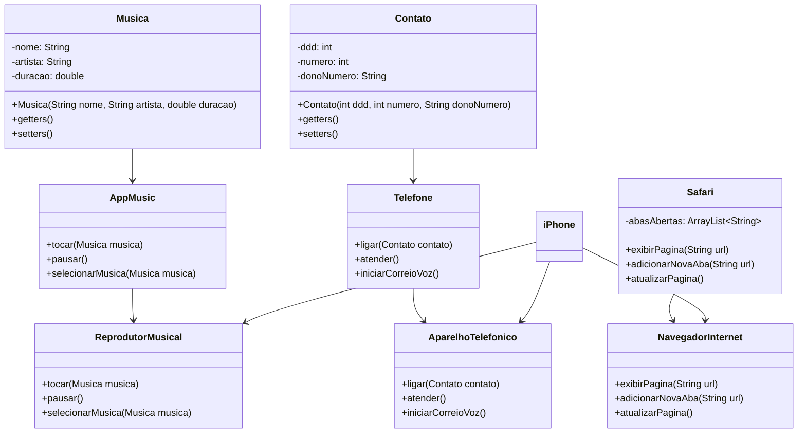

---

# Projeto: iPhone - Reprodutor Musical, Aparelho Telefônico e Navegador na Internet

Este projeto foi desenvolvido como parte de um desafio que visa a modelagem e implementação de um iPhone com três funcionalidades principais: Reprodutor Musical, Aparelho Telefônico e Navegador na Internet. O desafio foi baseado no vídeo de lançamento do iPhone em 2007.

## Descrição

O objetivo deste projeto foi modelar e diagramar, usando UML, as principais funcionalidades de um iPhone, representadas através das seguintes interfaces:
- **Reprodutor Musical**: Para tocar, pausar e selecionar músicas.
- **Aparelho Telefônico**: Para realizar, atender chamadas e iniciar correio de voz.
- **Navegador na Internet**: Para exibir páginas, abrir novas abas e atualizar páginas.

Além disso, as classes correspondentes foram implementadas em Java.

## Tecnologias

- **Linguagem**: Java
- **Modelagem UML**: Astah UML
- **Paradigma**: Programação Orientada a Objetos (POO)

## Como rodar o projeto

1. Clone o repositório:
   ```bash
   git clone https://github.com/SantFabio/modelagem-e-diagramacao-UML-do-componente-iPhone
   ```

2. Importe o projeto em sua IDE preferida (ex.: Eclipse, IntelliJ, VSCode).

3. Compile e execute o projeto.

## Diagrama UML

Aqui está o diagrama UML representando as classes e interfaces deste projeto:

## Conclusão

Este projeto foi uma excelente oportunidade para aplicar conhecimentos em Lógica de Programação, Programação Orientada a Objetos e Java, além de reforçar as habilidades de modelagem UML.

---

